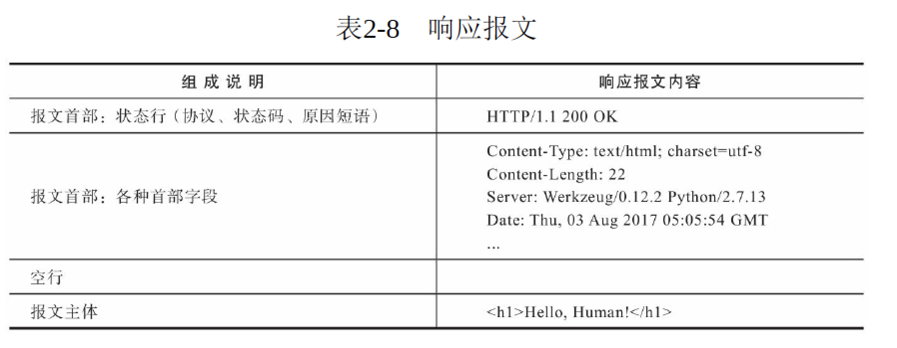
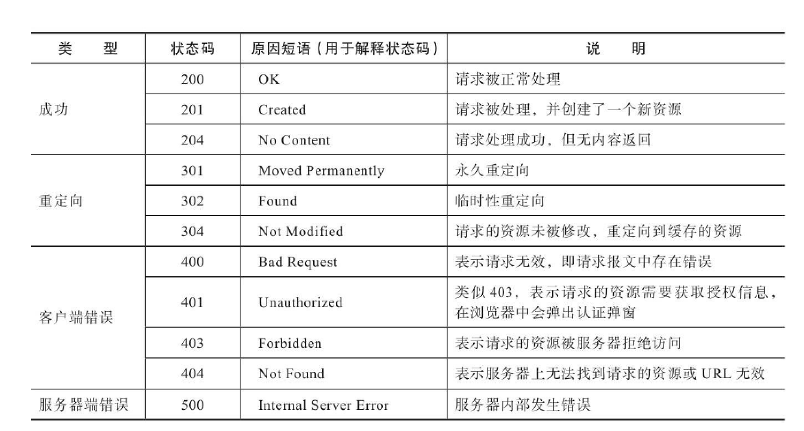

## Flask与HTTP

* 从URL开始：URL是一个请求的起源,这个URL后面的？name=Grey部分是查询字符串（query string）。URL中的查询字符串用来向指定的资源传递参数。查询字符串从问号？开始，以键值对的形式写出，多个键值对之间使用&分隔。


* 请求报文和响应报文：请求时浏览器发送的数据被称为请求报文，而服务器返回的数据被称为响应报文。


HTTP通过方法来区分不同的请求类型。比如，当你直接访问一个页面时，请求的方法是GET；当你在某个页面填写了表单并提交时，请求方法则通常为POST。

* Request对象：这个请求对象封装了从客户端发来的请求报文，我们能从它获取请求报文中的所有数据，常用属性和方法如下图。


* 路由匹配：为了便于将请求分发到对应的视图函数，程序实例中存储了一个路由表（app.url_map），其中定义了URL规则和视图函数的映射关系。当请求发来后，Flask会根据请求报文中的URL（path部分）来尝试与这个表中的所有URL规则进行匹配，调用匹配成功的视图函数。如果没有找到匹配的URL规则，说明程序中没有处理这个URL的视图函数，Flask会自动返回404错误响应（Not Found，表示资源未找到）。
    * 使用flask routes命令可以查看程序中定义的所有路由，这个列表由app.url_map解析得到。
    * 设置监听的HTTP方法：每一个路由除了包含URL规则外，还设置了监听的HTTP方法。当某个请求的方法不符合要求时，请求将无法被正常处理，这时Flask会自动返回一个405错误响应（MethodNot Allowed，表示请求方法不允许）。
    * Flask内置的URL变量转换器：转换器通过特定的规则指定，即“<转换器：变量名>”。<int：year>把year的值转换为整数，在用法上唯一特别的是any转换器，你需要在转换器后添加括号来给出可选值，即“<any（value1，value2，...）：变量名
    
* 请求钩子：有时我们需要对请求进行预处理（preprocessing）和后处理（postprocessing），这时可以使用Flask提供的一些请求钩子（Hook），它们可以用来注册在请求处理的不同阶段执行的处理函数。after_request钩子和after_this_request钩子必须接收一个响应类对象作为参数，并且返回同一个或更新后的响应对象。


## 响应报文
响应报文：响应报文主要由协议版本、状态码（status code）、原因短语（reason phrase）、响应首部和响应主体组成。




完整地说，视图函数可以返回最多由三个元素组成的元组：响应主体、状态码、首部字段。其中首部字段可以为字典，或是两元素元组组成的列表。在多数情况下，除了响应主体，其他部分我们通常只需要使用默认值即可。
```
    @app.route('/hello')
    def hello():
        return '', 302, {'Location', 'http://www.example.com'}
```    

* 重定向：使用redirect（）函数时，默认的状态码为302，即临时重定向。如果你想修改状态码，可以在redirect（）函数中作为第二个参数或使用code关键字传入。

* 错误响应：在abort（）函数中传入状态码即可返回对应的错误响应，abort（）函数前不需要使用return语句，但一旦abort（）函数被调用，abort（）函数之后的代码将不会被执行

* 响应格式：在HTTP响应中，数据可以通过多种格式传输。大多数情况下，我们会使用HTML格式，这也是Flask中的默认设置。在特定的情况下，我们也会使用其他格式。不同的响应数据格式需要设置不同的MIME类型。MIME类型在首部的Content-Type字段中定义。如果你想使用其他MIME类型，可以通过Flask提供的make_response（）方法生成响应对象，传入响应的主体作为参数，然后使用响应对象的mimetype属性设置MIME类。
```
MIME类型（又称为media type或content type）是一种用来标识文件类型的机制，它与文件扩展名相对应
https://www.iana.org/assignments/media-types/media-types.xhtml
```

    * jsonify函数：利用这个函数我们仅需要传入数据或参数，它会对我们传入的参数进行序列化，转换成JSON字符串作为响应的主体，然后生成一个响应对象，并且设置正确的MIME类型,可以不使用json模块了。