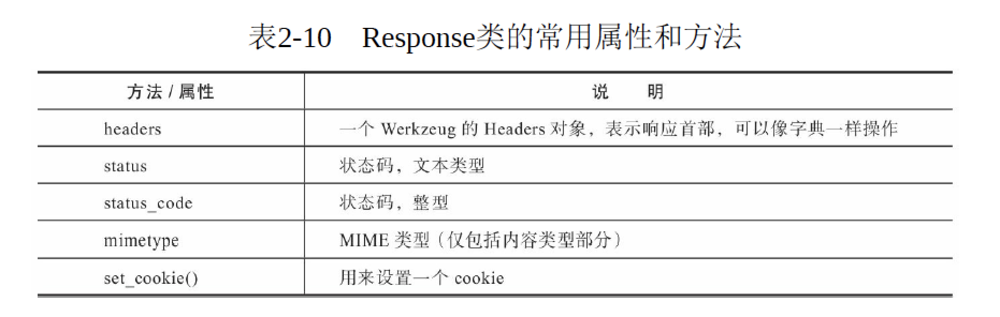
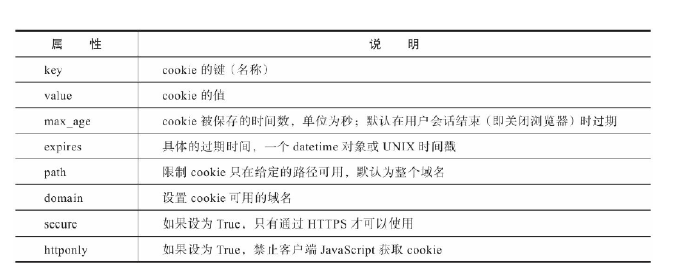

## COOKIE

HTTP是无状态（stateless）协议。也就是说，在一次请求响应结束后，服务器不会留下任何关于对方状态的信息.为了解决这类问题，就有了Cookie技术。Cookie技术通过在请求和响应报文中添加Cookie数据来保存客户端的状态信息。

```
简介：
    Cookie指Web服务器为了存储某些数据（比如用户信息）而保存在浏览器上的小型文本数据。
    浏览器会在一定时间内保存它，并在下一次向同一个服务器发送请求时附带这些数据。
用处：
    保存用户的个性化信息（比如语言偏好，视频上次播放的位置，网站主题选项等）以及记录和收集用户浏览数据
    以用来分析用户行为等。
```

在Flask中，如果想要在响应中添加一个cookie，最方便的方法是使用Response类提供的set_cookie（）方法。要使用这个方法，我们需要先
使用make_response（）方法手动生成一个响应对象，传入响应主体作为参数。



set_cookie（）方法支持多个参数来设置Cookie的选项，如下表所示。



当浏览器保存了服务器端设置的Cookie后，浏览器再次发送到该服务器的请求会自动携带设置的Cookie信息，Cookie的内容存储在请求首
部的Cookie字段中。在Flask中，Cookie可以通过请求对象的cookies属性读取。如果直接把认证信息以明文的方式存储在Cookie里，那么恶意用户就可以通过伪造cookie的内容来获得对网站的权限，冒用别人的账户。为了避免这个问题，我们需要对敏感的Cookie内容进行加密。方便的是，Flask提供了session对象用来将Cookie数据加密储存。

## SESSION

* 基本概念：session指用户会话（user session），又称为对话，即服务器和客户端/浏览器之间或桌面程序和用户之间建立的交互活动。在Flask中，session对象用来加密Cookie。默认情况下，它会把数据存储在浏览器上一个名为session的cookie里。这个session对应的value是加密过的session字典【session数据多，这个value就很长】。

* 配置SECRET_KEY：flask的session是通过加密之后放到了cookie中。所以有加密就有密钥用于解密，所以，只要用到了flask的session模块就一定要配置“SECRET_KEY”这个全局宏。一般设置为24位的字符。session的值是加密处理cookie后的值。使用session对象存储的cookie，用户可以看到加密后的值，但是不能修改。因为session中的内容使用密钥进行签名加密，一旦数据被篡改，签名的值也会变化，这样在读取时，就会验证失败，对应的session值也会随之失效。

* session中的数据可以像字典一样通过键读取，或是使用get方法。session.pop('username') 用于移除

* 有效期设置：默认情况下，session cookie会在用户关闭浏览器时删除。通过将session.permanent属性设为True可以将session的有效期延长为Flask.permanent_session_lifetime属性值对应的datetime.timedelta对象，也可通过配置变量PERMANENT_SESSION_LIFETIME设置，默认为31天。


