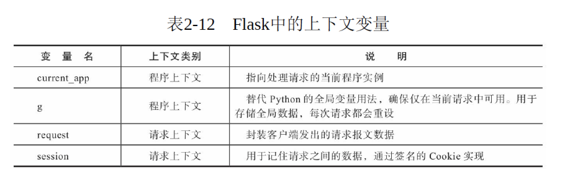
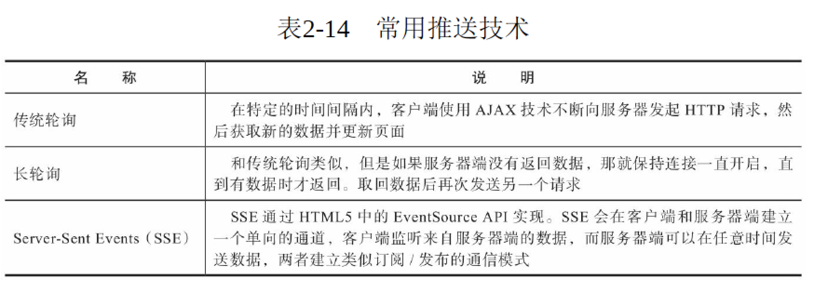

## 上下文context

Flask中有两种上下文，程序上下文（application context）和请求上下文（request context）。

```
如果鱼想要存活，水是必不可少的元素。对于Flask程序来说，程序上下文就是我们的水。水里包含了各种浮游生物以
及微生物，正如程序上下文中存储了程序运行所必须的信息，当客户端发来请求时，请求上下文就登场了。请求上下文里包含
了请求的各种信息，比如请求的URL，请求的HTTP方法等。
```

* 上下文全局变量：每一个视图函数都需要上下文信息，在前面我们学习过Flask将请求报文封装在request对象中。按照一般的思路，如果我们要在视图函数中使用它，就得把它作为参数传入视图函数，实际使用事并没有传递这个参数，而是直接从Flask导入一个全局的request对象，Flask会在每个请求产生后自动激活当前请求的上下文，激活请求上下文后，request被临时设为全局可访问。而当每个请求结束后，Flask就销毁对应的请求上下文。
```
因此，请求对象只在各自的线程内是全局的。Flask通过本地线程（thread local）技术将请求对象在特定的线程和请求中全局可访问
```



* current_app变量:程序也会有多个程序实例的情况，为了能获取对应的程序实例，而不是固定的某一个程序实例，需要使用current_app变量，g变量：存储全局数据

* 激活上下文：当请求进入时，Flask会自动激活请求上下文，这时我们可以使用request和session变量。另外，当请求上下文被激活时，程序上下文也被自动激活。
```
同样依赖于上下文的还有url_for（）、jsonify（）等函数，所以你也只能在视图函数中使用它们。
```


## 推和拉

* 客户端拉取：不论是传统的HTTP请求-响应式的通信模式，还是异步的AJAX式请求，服务器端始终处于被动的应答状态，只有在客户端发出请求的情况下，服务器端才会返回响应。这种通信模式被称为客户端拉取（client pull）。

* 服务器主动推送：在某些场景下，我们需要的通信模式是服务器端的主动推送（server push）。比如，一个聊天室有很多个用户，当某个用户发送消息后，服务器接收到这个请求，然后把消息推送给聊天室的所有用户。实现服务器端推送的一系列技术被合称为HTTP Server Push（HTTP服务器端推送），目前常用的推送技术如下表所示：



除了这些推送技术，在HTML5的API中还包含了一个WebSocket协议，和HTTP不同，它是一种基于TCP协议的全双工通信协议（fullduplex
communication protocol）。和前面介绍的服务器端推送技术相比，WebSocket实时性更强，而且可以实现双向通信（bidirectional
communication）。另外，WebSocket的浏览器兼容性要强于SSE。